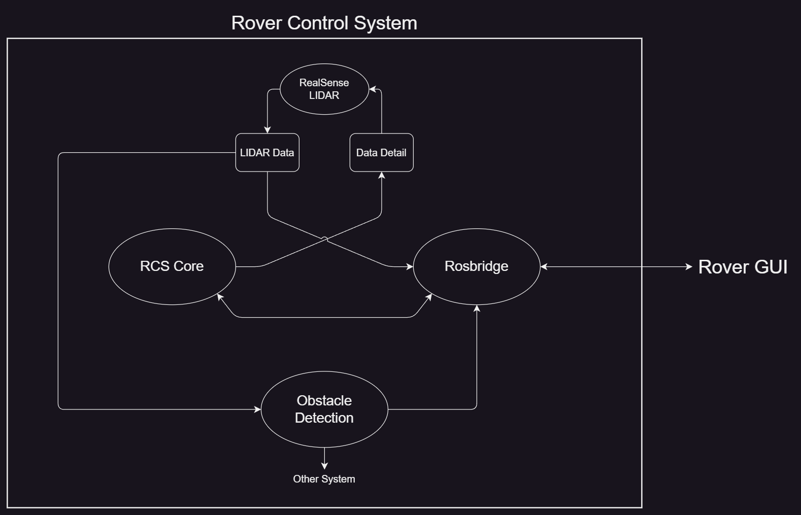

# Rover Control System (RCS)

## :warning: This is experimental! All contents are subject to frequent change. :warning:

The Rover Control System (RCS) is a system that allows high-level systems to operate the rover without dealing with specific details of how the rover works.
RCS facilitates communication between two types of entities: **components** and **systems**.

RCS is designed with three major goals in mind

- **Modularity**: RCS is flexible and can be easily upgraded or modified to extend or alter its capabilities. The modification of one part of RCS should not affect the rest.
- **Reliability**: RCS can withstand and recover from unforeseen challenges, such as network outages or component failures, while maintaining consistent operation as a whole.
- **Simplicity**: RCS has little to no overhead and focuses on the movement of data between components and systems.

Technical Specifications for RCS can be found [here](./docs/tech_specs.md).

## Quick Start

Once you have cloned the repository, you can run the following commands to start RCS:

```bash
# While in the root of the repository

# Build and run the docker image
start_jetson.sh

# Alternatively, you can force a rebuild of the docker image before running
start_jetson_fresh.sh

# Once inside the docker image, launch RCS
ros2 launch auto_launch/launch.xml
```

RCS will now be running on the rover. You can now connect to the rover using the GUI.

## Components

RCS mirrors the physical layout of the rover, which consists of several components (motors, sensors, cameras, etc) that are connected together physically.

Each component on the rover will usually have a counterpart in RCS. For example, a camera would have a RCS component that would allow it to send image data to other components and systems. Components should avoid doing processing of data, and instead focus sending, receiving, or acting on data.

## Systems

Systems are high-level entities that use data from components or operators to control the rover through additional components. Systems are the primary way that data is processed and interpreted. Systems are more abstract than components, and can use multiple components to achieve a goal.

Systems can either be **Intra-Rover** or **Remote**

- **Intra-Rover**: Intra-Rover systems are systems that are running on the rover itself. They use the ROS network to communicate with other components and systems. For example, a computer vision system that detects obstacles would be an intra-rover system because it would run on the rover itself.
- **Remote**: Remote systems are systems that are running outside of the rover. They have to use rosbridge to communicate with the ROS network, but can otherwise act as if they were on the rover. However, these systems are not guaranteed to have a reliable connection to the rover, and should be able to handle network outages or signal degradation.

In practice, the primary Remote system will be the GUI.

## RCS Core

The RCS Core maintains certain key functions of the rover. It is responsible for the heartbeat of the rover, and can detect and handle network latency or outages. It can then ask that components or systems reduce their bandwidth usage, or even disable certain components or systems entirely.

### Heartbeat

Periodically, the RCS Core will send small messages to components to check if they are still connected. If a component does not respond in time, the RCS Core will assume that the component is no longer connected, and will attempt either to reconnect or otherwise handle the loss of the component. Additionally, the RCS Core will send a message to the operator to notify them of the failure.

### Bandwidth Management

The RCS Core will also maintain a heartbeat with the operator. The heartbeat messages will be timestamped, allowing latency to be calculated. If the RCS Core detects that the latency is too high or bandwidth is too low, then it will begin to reduce the amount of data that is sent to the operator. Components and systems are responsible for reducing their bandwidth usage when requested by the RCS Core.

### Bandwidth Reduction

Bandwidth reduction happens in 4 levels

- Level 0: No reduction - All data may be sent
- Level 1: Minor reduction - Non-essential data should be reduced and/or sent less frequently
- Level 2: Moderate reduction - Reduce amount and frequency of data for all, non-essential data may be disabled
- Level 3: Major reduction - Only essential components and systems may send data

## Example

Here is an example of how RCS would work in practice.



1. The RealSense component makes point cloud data available using a ROS topic.
2. The RealSense also has a topic that can be published to to change the amount of points in the point cloud.
3. The object detection system subscribes to the point cloud topic and uses it to detect objects.
4. The object detection system can then publish to other systems, such as the GUI, to display the detected objects.
5. The GUI can display the point cloud information to the operator, giving them a better understanding of the rover's surroundings.
6. The RCS Core manages the heartbeat of the rover, and can detect and handle network latency or outages. It can then adjust the detail of the point cloud to use less bandwidth, or even disable the point cloud entirely.
7. Throughout this example, Rosbridge has been sending data to and from the GUI.
